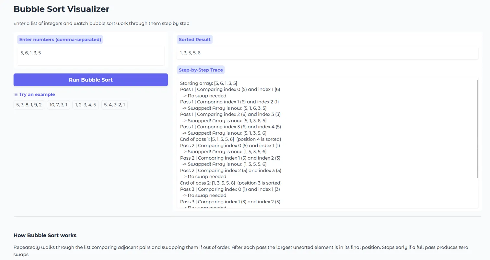

# Bubble Sort Visualizer

Interactive Python app that demonstrates Bubble Sort step by step, built with Gradio and deployed on Hugging Face Spaces.

---

## Demo

> 

**Example — input `5, 3, 8, 1, 9, 2`:**
```
Starting array: [5, 3, 8, 1, 9, 2]
Pass 1 | Comparing index 0 (5) and index 1 (3)
  -> Swapped! Array is now: [3, 5, 8, 1, 9, 2]
...
Final sorted array: [1, 2, 3, 5, 8, 9]
```

---

## Problem Breakdown & Computational Thinking

**Why Bubble Sort?**
One of the most intuitive sorting algorithms — every comparison and swap maps directly to something you'd do ordering a hand of cards, which makes it easy to visualize and teach.

**Decomposition**
| Sub-task | What it does |
|---|---|
| Parse input | Split comma-separated string into a list of ints |
| Outer loop | Repeat n passes |
| Inner loop | Walk adjacent pairs from index 0 to n−i−1 |
| Compare & swap | Swap neighbours if out of order |
| Early exit | Stop if a full pass produces zero swaps |
| Record steps | Append a line for every comparison and swap |
| Display | Show trace log and final result in Gradio |

**Pattern Recognition**
- Each pass guarantees the largest unsorted element moves to its final position
- Inner loop shrinks by one every pass — no need to re-check sorted positions
- Already-sorted input triggers early exit after one pass

**Abstraction**
- User only sees numbers in, sorted numbers out, plus the trace
- Index arithmetic and swap mechanics are hidden inside `bubble_sort_steps()`
- Input validation gives friendly messages instead of Python tracebacks

**Algorithm Design**
```
User enters numbers
        ↓
Validate & parse -> list of ints
        ↓
bubble_sort_steps(arr)
  outer loop  i = 0 to n-1
    inner loop  j = 0 to n-i-2
      compare arr[j] vs arr[j+1]
      swap if out of order -> record step
    if no swap this pass -> break early
  return (steps list, sorted array)
        ↓
Gradio shows step log + sorted result
```

---

## Testing & Verification

| Input | Expected Output | Result |
|---|---|---|
| `5, 3, 8, 1, 9, 2` | `1, 2, 3, 5, 8, 9` | Correct |
| `1, 2, 3, 4, 5` | `1, 2, 3, 4, 5` | Correct, early exit after 1 pass |
| `5, 4, 3, 2, 1` | `1, 2, 3, 4, 5` | Correct, worst case, all passes run |
| `10, 7, 3, 1` | `1, 3, 7, 10` | Correct |
| `3, 3, 3` | `3, 3, 3` | Correct, handles duplicates |
| `abc, 1, 2` | Error message | Caught, invalid input handled gracefully |
| *(empty)* | Error message | Caught, empty input handled gracefully |

Screenshot of a test run is shown in the Demo section above.

---

## Steps to Run

**Locally**
```bash
pip install gradio
python app.py
# open http://127.0.0.1:7860
```

**On Hugging Face Spaces**
1. Create a new Space and select the Gradio template
2. Upload `app.py` and `requirements.txt`
3. Wait for build to finish - app goes live automatically

---

## Hugging Face Link

> [tripathipranav/bubble-sort-visualizer](https://huggingface.co/spaces/tripathipranav/bubble-sort-visualizer)

---

## Author & Acknowledgment

**Author:** Pranav Tripathi  
**Student Number:** 20388092  
**Course:** CISC-121 - Queen's University  
**Instructor:** Dr. Rahatara Ferdousi 
